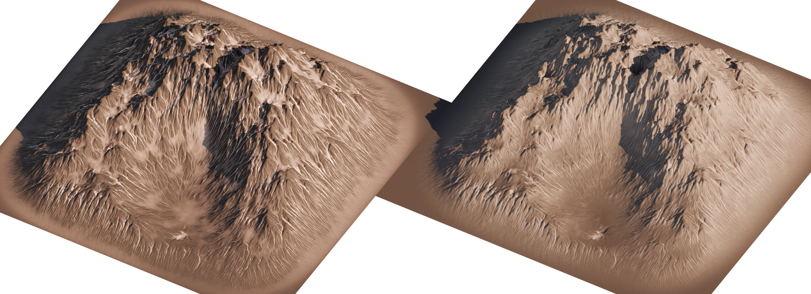
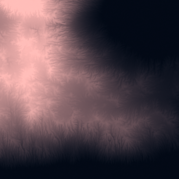
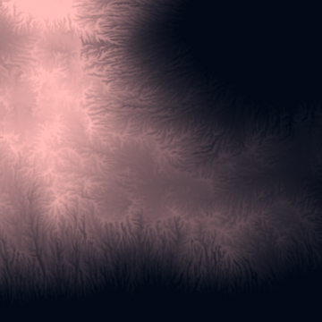
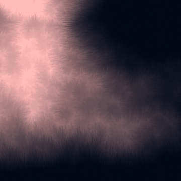
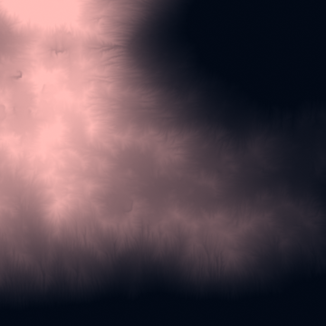
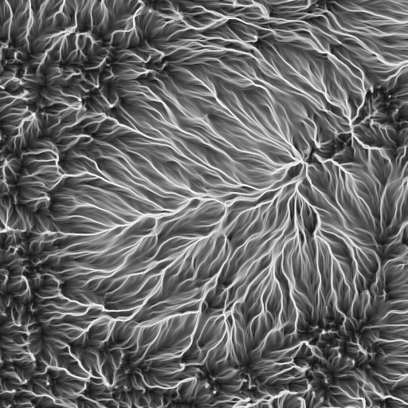

# Hydra - GPU Erosion in Blender

Setup guide
===========

To install this project, download the latest [Release](https://github.com/ozikazina/Hydra/releases) and import the **zip** file into Blender addons, then activate it.

This project requires external dependencies (~5 MB), which can be downloaded with a provided button in the preferences.
Executing this command will probably require elevated privileges. If the installation fails, launch Blender as an administrator and try again.
If it succeeds, restart the app normally.

The addon page will indicate whether the dependencies are installed.

If you have the Fedora operating system, this addon might not work because of this dependency.

Manual dependency installation or update
----------------------------

Go to your Blender installation directory and to the version you want to use. Then navigate to the `python\bin` directory. As an example for Windows:

`C:\Program Files\Blender Foundation\Blender {Version}\{Version}\python\bin`

Once there, open this folder in the command line and install ModernGL through the Python executable:

`python.exe -m pip install --upgrade moderngl`

or

`./python -m pip install --upgrade moderngl`

Uninstalling
------------

To uninstall the project, go to the addons tab and press remove. Removing the ModernGL library needs to be done manually.

Go to the Python folder specified above in the [Manual ModernGL installation](#manual-moderngl-installation) section and execute:

`python.exe -m pip uninstall moderngl`

or

`./python -m pip uninstall moderngl`

Addon usage
===========

This addon supports erosion for individual **objects** and **images**. It can be found in the right side panel in both `3D View` and `Image Editor` windows in the Hydra tab.

Water erosion
=============

To erode objects, select any object with a mesh and simply press *Erode* in the corresponding tab.
Objects with overlapping geometry are supported, but the resulting heightmap might not be applicable back to the object.

Once erosion starts, the object or image is converted into a heightmap. In the case of objects, the chosen image resolution becomes locked.

> To pick a different resolution, you first have to clear generated textures for the current object.

> If the height of the object changes (e.g. you apply Scale), you should also first clear existing heightmaps.

Two heightmaps are created - **Source** and **Result**.

- `Source` - Starting point for erosion.
- `Result` - Result of erosion. It is automatically previewed.

Choosing different parameters and eroding again will start erosion from the Source map, giving you the option to test different settings.

To use the Result map as a starting point and to exchange maps between thermal and water erosion, apply it as a Source in the *Heightmaps* subtab. The Source layer can also be set back as Result to be exported or applied.

Additional outputs
---------------

Water erosion can also create extra output maps:

- `Color` - Provided color map will be transported by erosion.
- `Sediment`- Map of sedimentation amounts.
- `Depth` - Map of erosion depth.

---
### Color transport:

### Sediment and Depth maps:

Applying results
----------------

The resulting map can be applied in the following ways using buttons in the *Heightmaps* subtab:

| | |
| --: | -- |
| `Nodes` | Creates a Geometry Nodes group for the object. |
| `Modifier` | Adds a Displace modifier to the object. |
| `Displacement` | Adds a displacement map to the first material slot. Creates material if necessary.|
| `Bump` | Adds a bump map to the first material slot. Creates material if necessary.|
| `Mesh` | Applies modifiers to the mesh. Available if the preview or modifier option was chosen.|
| `Shape Key` | Applies modifiers as a shape key. Available if the preview or modifier option was chosen.|
| `Image` | Creates a Blender image of the corresponding heightmap.|

Parameters
----------

Water erosion has the following parameters:

| | |
| --: | -- |
| `Iterations` | Number of iterations to perform. |
| `Lifetime` | Number of steps a particle can take in an iteration. |
| `Acceleration` | Defines how strongly slopes affect particle movement. |
| `Drag` | Slows down particle movement. |
| `Erosion Smoothness` | Erosion strength. Slightly smoothes surface features. |
| `Deposition Strength` | Rate of sedimentation. |
| `Capacity` | Particle material capacity. Higher values lead to deeper features. |

| | |
| :--: | :--: |
|  |  |
| High acceleration | High capacity |
|  |  |
| Short lifetime | High smoothness |

Flow generation
=========

A special tab is offered for flow map generation. The output texture stores flow concentration, which can be varied by a contrast slider.
Particle settings are shared with water erosion.

Thermal erosion
===============

The addon similarly supports thermal erosion, where steep surfaces cause material to slide down. It produces smooth slopes with a specified maximum angle.

Heightmap generation
====================

Heightmaps can be generated directly at an arbitrary resolution. Cached heightmaps are also offered for direct export. This addon now creates three types of heightmaps:
| | |
| --: | -- |
| `Normalized` | Heights are scaled to the range \[0,1\]. |
| `Proportional` | Z to X ratio is preserved. |
| `World scale` | Values are directly equal to height without scale applied. |

License
=======

This project is released under the MIT license. It is also a Bachelor's thesis implementation for the Brno University of Technology, other limitations may therefore apply.