# Hydra - GPU Erosion in Blender

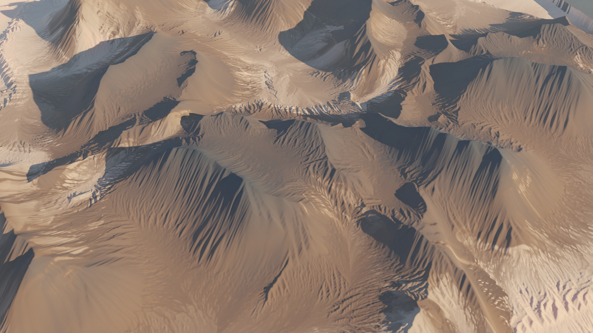

Setup guide
===========

To install this project, download the latest [Release](https://github.com/ozikazina/Hydra/releases) and import the **zip** file into Blender add-ons, then activate it.

This project requires external dependencies (~5 MB), which can be downloaded with a provided button in the preferences. Executing this command will probably require elevated privileges. If the installation fails, launch Blender as an administrator and try again. If it succeeds, restart the app normally.

The add-on page will indicate whether the dependencies are installed.

If you have the Fedora operating system, this add-on might not work because of this dependency.

Manual dependency installation or update
----------------------------

Go to your Blender installation directory and to the version you want to use. Then navigate to the `python\bin` directory. As an example for Windows:

`C:\Program Files\Blender Foundation\Blender {Version}\{Version}\python\bin`

Once there, open this folder in the command line and install ModernGL through the Python executable:

`python.exe -m pip install --upgrade moderngl`

or

`./python -m pip install --upgrade moderngl`

Uninstallation
------------

To uninstall the project, go to the add-ons tab and press remove. Removing the ModernGL library needs to be done manually.

Go to the Python folder specified above in the [Manual ModernGL installation](#manual-moderngl-installation) section and execute:

`python.exe -m pip uninstall moderngl`

or

`./python -m pip uninstall moderngl`

Add-on usage and principles
===========

This add-on supports erosion for individual **objects** and **images**. It can be found in the right side panel in **3D&nbsp;View** and **Image&nbsp;Editor** windows in the Hydra tab.

The add-on works by converting Blender objects and images into [internal heightmaps](#heightmaps-and-applying-results). These heightmaps have the resolution of the original image or a chosen resolution for objects. Resolution can drastically change the size and shape of resulting features:

| **256x256 px** | **512x512 px** |
| :--: | :--: |
| 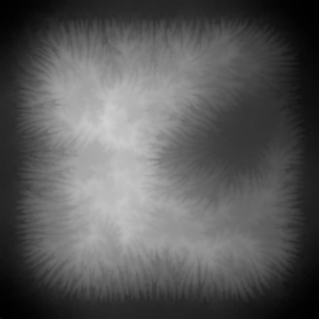 | 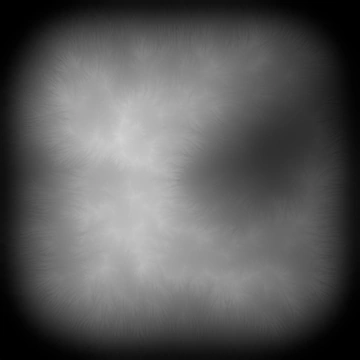 |

- Once erosion starts, the resolution becomes locked. To pick a different resolution you first have to **clear&nbsp;(C)** generated textures for the current object.

- If the height of the object changes (e.g. you apply Scale) or the resolution of the original image changes, then you should first clear existing heightmaps.

- Objects with overlapping geometry are supported, but the resulting heightmap might create unwanted deformations when applied back to the object.

Heightmaps and applying results
----------

The add-on creates two internal heightmaps - **Source** and **Result**.

- `Source` - Starting point for erosion.
- `Result` - Result of erosion. It is automatically previewed.

Choosing different parameters and eroding again will start erosion from the Source map, giving you the option to test different settings. To use the Result map as a starting point, use:
 - **Set & Continue (B)** - which sets *Result* as *Source* and starts erosion - or
 - **Set as Source (E)**

The *Result* map can be applied in the following ways using buttons in the *Heightmaps* subtab.

### Object options

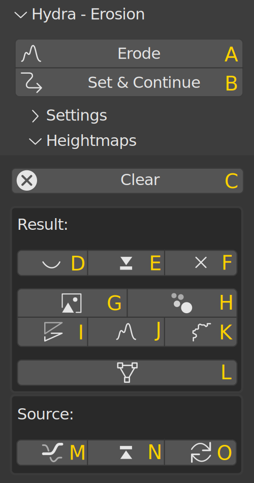
<table class="ui_table">
<thead>
    <th width=100px>Type</th>
    <th>Button</th>
    <th>Description</th>
</thead>
<tr>
    <td><code>Image</code></td><td>G</td><td>
        Creates a Blender image of the resulting heightmap.
    </td>
</tr>
<tr><td><code>Nodes</code></td><td>H</td><td>
    Applies erosion as a Geometry Nodes group.
</td></tr>
<tr><td><code>Modifier</code></td><td>I</td><td>
    Applies erosion as a Displace modifier.
</td></tr>
<tr><td><code>Displacement</code></td><td>J</td><td>
    Adds a displacement map to the first material slot. Creates material if necessary.
</td></tr>
<tr><td><code>Bump</code></td><td>K</td><td>
    Adds a bump map to the first material slot. Creates material if necessary.
</td></tr>
<tr><td><code>Mesh</code></td><td>L</td><td>
    Applies modifiers to the mesh. Available if the preview or modifier option was chosen.
</td></tr>
</table>

### Image options

<table class="ui_table">
<thead>
    <th width=100px>Type</th>
    <th>Button</th>
    <th>Description</th>
</thead>
<tr>
    <td><code>Image</code></td><td>P</td><td>
        Creates a new Blender image of the resulting heightmap. This image won't be erased by launching erosion, unlike the image preview.
    </td>
</tr>
<tr><td><code>To Original</code></td><td>Q</td><td>
    Writes the resulting heightmap to the original image.
</td></tr>
</table>
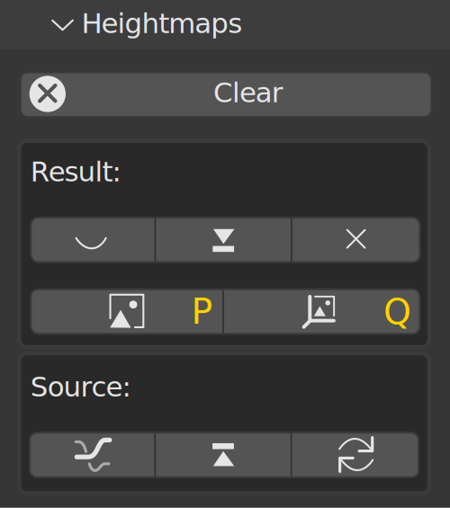

Water erosion
=============

The main focus of this add-on is water erosion, where the flow of water carves material away and deposits it lower down. Two types of water erosion are implemented: particle-based and pipe-based.

Both types have a **Simulation resolution** slider, which allows the user simulate erosion at different scales. It is recommended to start at **512x512** pixels for large scale features.

Both types also support variable hardness in the **Advanced** settings.

Particle-based erosion
----------------------

Particle-based erosion simulates water using particles moving across the terrain. It is stable for almost any terrain and resolution, but aggressive settings can sometimes produce errors around borders.

The number of particles simulated is fixed and **doesn't change with the heightmap resolution**. It can be increased for higher resolutions using the **Iterations** property.

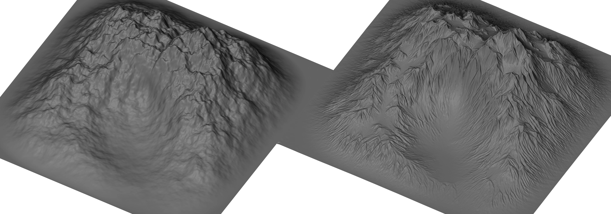

It has the following parameters:

| Parameter | Description |
| --: | -- |
| `Iterations` | Number of iterations to perform. Increases the number of particles simulated. |
| `Lifetime` | Number of steps a particle can take in an iteration. |
| `Smoothness` | Creates smoother and finer surface features. |
| `Deposition` | Strength of sedimentation. Can be used to disable sedimentation. |
| `Capacity` | Particle material capacity. Increases erosion strength. |
| `Acceleration` | Defines how strongly slopes affect particle movement. Increases erosion strength. |
| `Drag` | Slows down particle movement. Low drag creates larger streaks. |

### Parameter examples

| | |
| :--: | :--: |
| High capacity | High lifetime |
|  | 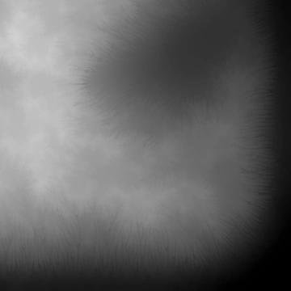 |
| High smoothness | Low drag |
| 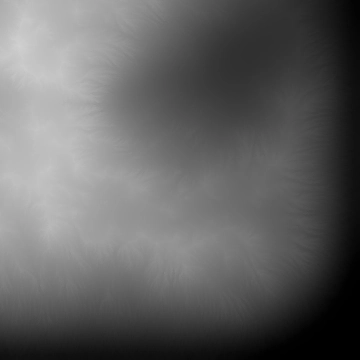 | 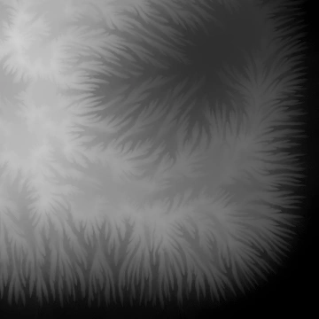 |

Pipe-based erosion
------------------

Pipe-based erosion creates more subtle sand-like terrains, but it is more difficult to set up and can be unstable. If the resulting terrain has ugly peaks, try decreasing capacity, iteration count, or increasing hardness.

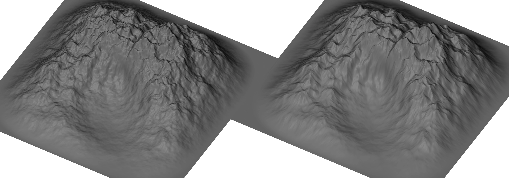

> When eroding images the effects of erosion can be hard to see in the resulting image. You can use the [Landscape](#landscape-generation) tab to see the results better.

It has the following parameters:

| Parameter | Description |
| --: | -- |
| `Iterations` | Number of iterations to perform. |
| `Hardness` | Concentrates erosion to larger streams. |
| `Capacity` | Increases erosion strength. |
| `Rain` | Low values bring out more detail. Higher values create larger gulleys. |

### Parameter examples

| | |
| :--: | :--: |
| Original | High hardness + High Iterations |
| 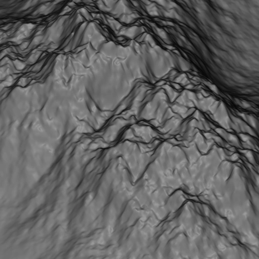 | 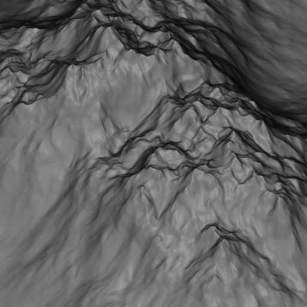 |
| Low rain + High hardness | High rain + Low capacity |
|  |  |

### Water source

This type of erosion can use a **texture as a water source** in the **Advanced** settings. Water is otherwise added evenly across the entire terrain.

| Source | Result |
| :--: | :--: |
| 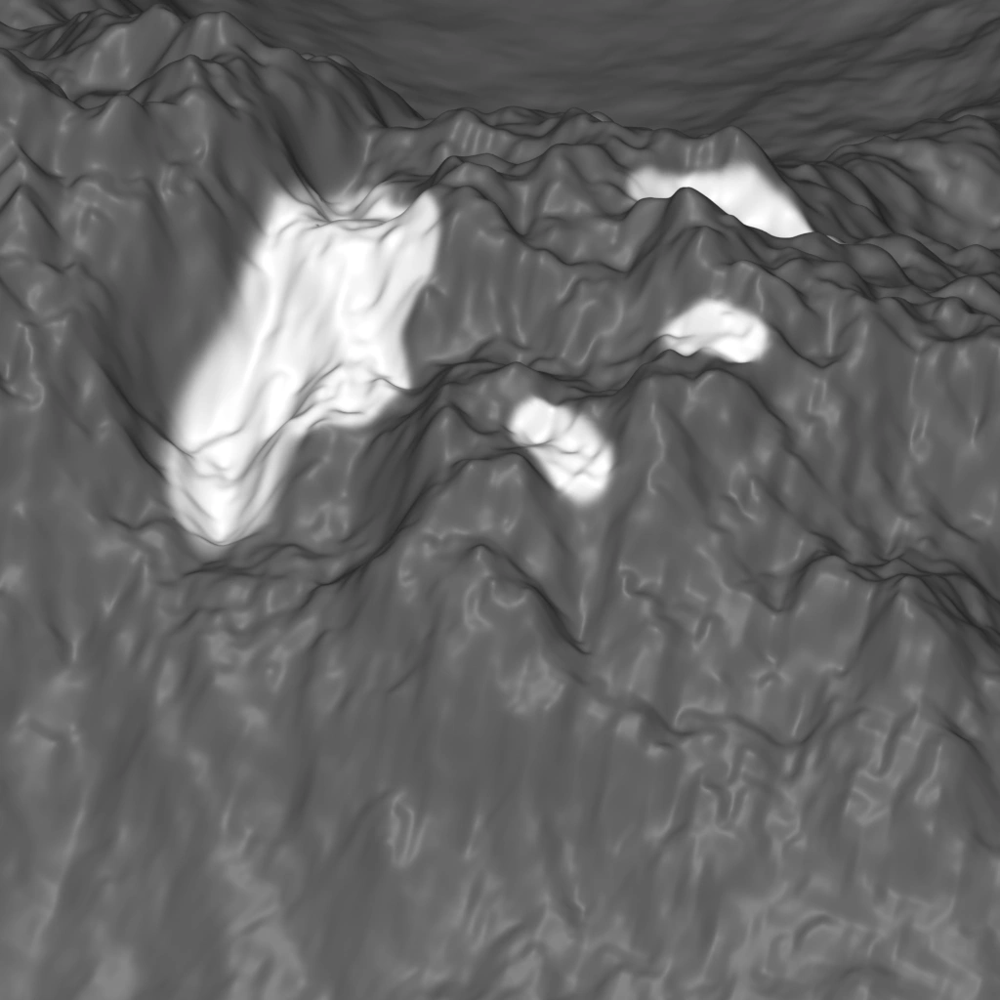 | 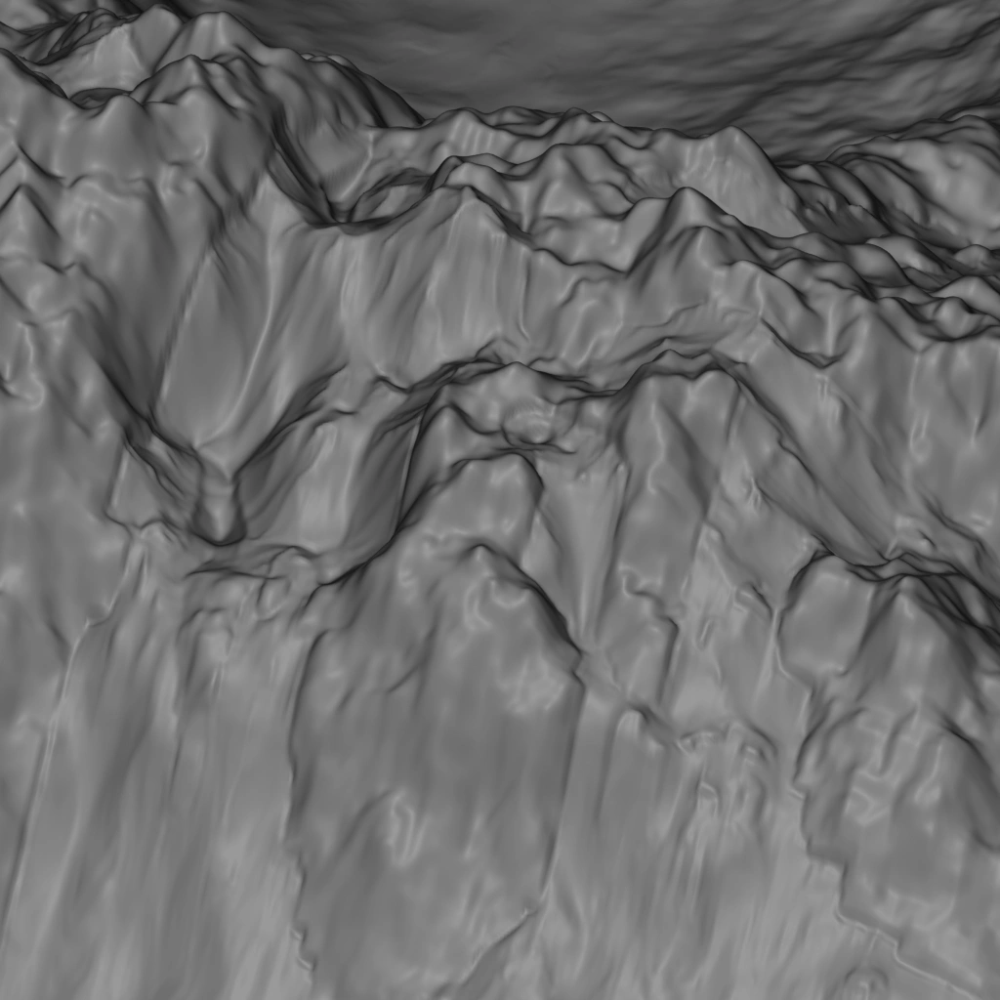 |

Thermal erosion
===============

The add-on similarly supports thermal erosion, where steep surfaces cause material to slide down. It produces smooth slopes with a specified maximum angle. It can also be used to fix extreme peaks and gulleys produced by aggressive water erosion.

Snow simulation
===============

The add-on offers a simple snow simulation, where a thin layer of material is placed on the terrain and moved by gravity. It can be used to simulate snow, sand, or gravel deposits or to fill deep gulleys.

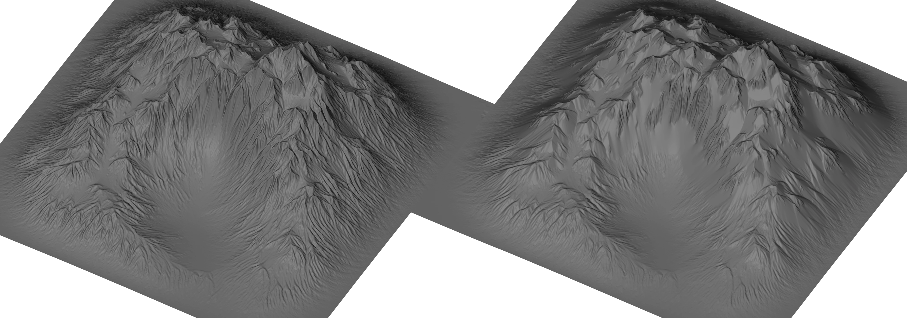

Snow simulation also outputs a texture with the resulting snow placement.

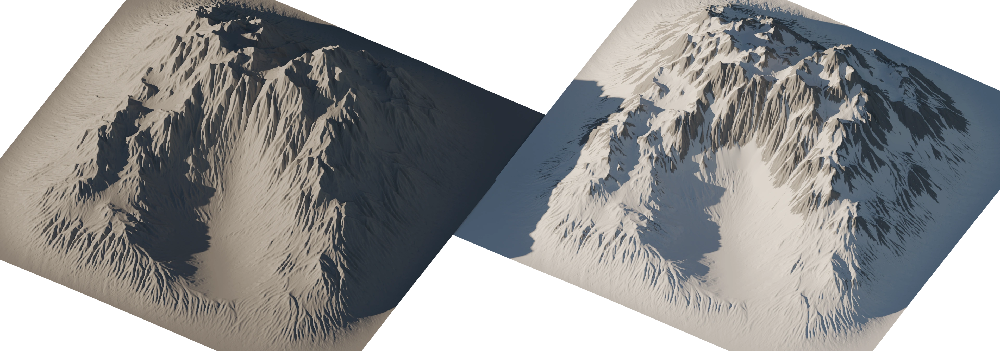

Extras
=========

A special tab is offered for flow map generation and color transport.

Color transport
---------------

Color transport takes an image and moves colors around based on the flow of water.

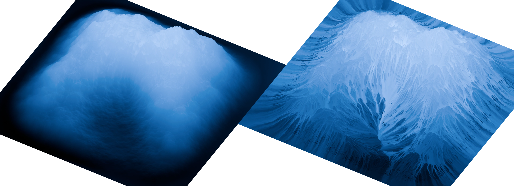

Similarly to water erosion, color transport has two solvers with different characteristics: particle-based and pipe-based.

| **Particle** | **Pipe** |
| :--: | :--: |
| 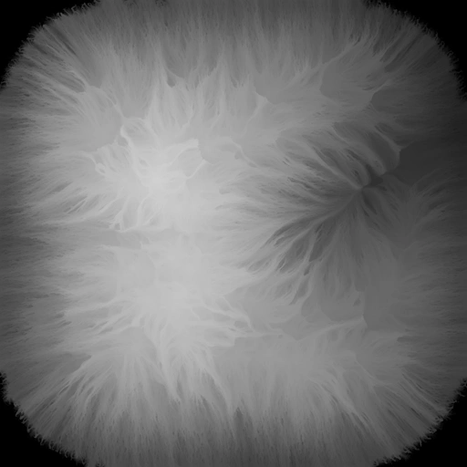 | 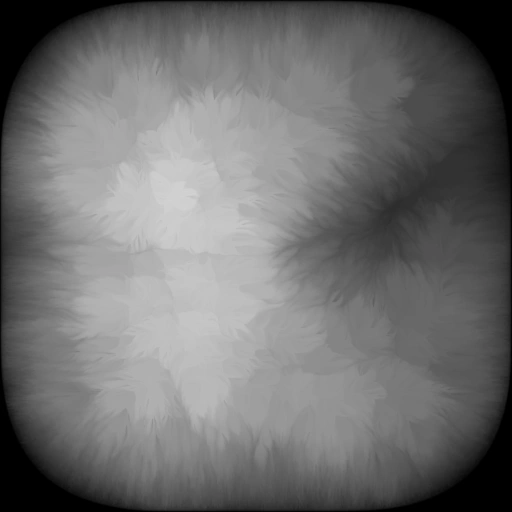 |

Flow maps
---------

The output texture stores flow concentration, which can be varied by a contrast slider.
Particle settings are shared with water erosion.

| Default | Low drag |
| :--: | :--: |
| 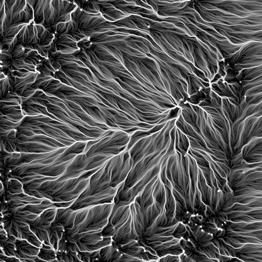 | 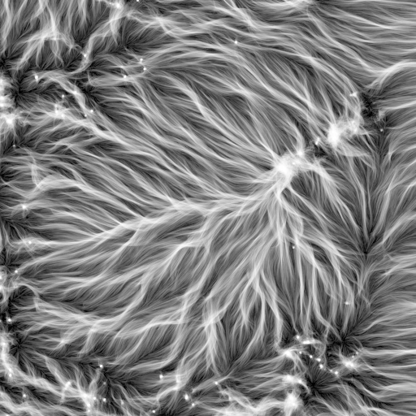 |

Heightmap generation
====================

Heightmaps can be generated directly at an arbitrary resolution. Cached heightmaps can also be directly exported in this tab. The following types of heightmaps can be generated:
| Type | Descripion |
| --: | -- |
| `Normalized` | Heights are scaled to the range \[0,1\]. |
| `Proportional` | Vertical angles are preserved. |
| `Local size` | Equal to object height without scale applied. |
| `World size` | Equal to world height. |

Landscape generation
====================
The image viewer tab also has a utility to generate landscapes directly from heightmaps. It is placed at the 3D cursor and a 3D View is automatically opened to view it.

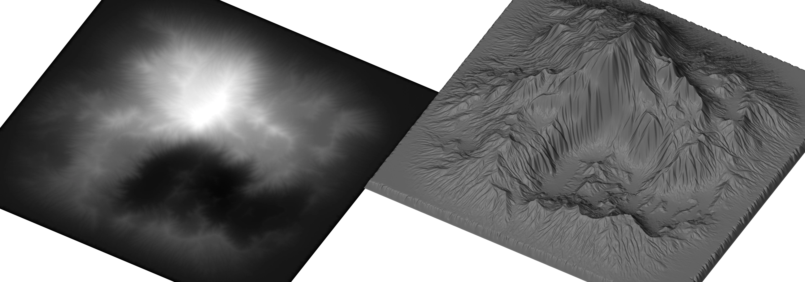

Future plans
============
 - Planetary erosion
 - Unified node-based UI
 - CUDA acceleration

License
=======

This project is released under the MIT license. It is also a Bachelor's thesis implementation for the Brno University of Technology, other limitations may therefore apply.